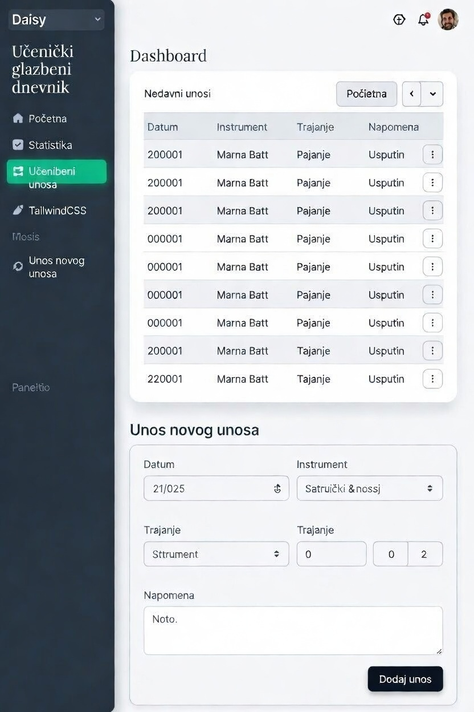

# Učenički glazbeni dnevnik  
### Web aplikacija za praćenje vježbanja glazbenog instrumenta

## 1. Opis projekta

Učenički glazbeni dnevnik je web aplikacija namijenjena učenicima glazbenih škola, samoukim glazbenicima ili svima koji uče svirati neki instrument. Glavni cilj aplikacije je omogućiti korisnicima da na jednostavan i organiziran način prate svoje svakodnevno vježbanje instrumenta, bilježe što su vježbali i koliko su vremena proveli vježbajući. Aplikacija također omogućuje pregled napretka kroz dane, što korisniku daje bolji uvid u njegovu disciplinu i razvoj glazbenih vještina.

Učenje sviranja instrumenta zahtijeva redovito vježbanje, ali mnogi učenici često nemaju pregled nad time koliko zapravo vježbaju i na čemu rade. Zbog toga je ideja ovog projekta razviti digitalni dnevnik vježbanja koji zamjenjuje klasične bilježnice ili papirnate dnevnike. U aplikaciji korisnik može svaki dan zapisati koliko je vremena vježbao (npr. u minutama ili satima), što je točno vježbao (npr. ljestvice, određenu pjesmu ili tehniku) te dodatne napomene o svom napretku.

Aplikacija je zamišljena kao jednostavna i pregledna platforma koja motivira korisnike na redovit rad. Pregled dnevnih zapisa omogućuje korisniku da vidi svoj napredak kroz vrijeme, a time može lakše pratiti vlastitu disciplinu i razvoj. Na primjer, korisnik može vidjeti koliko je vježbao tijekom tjedna ili mjeseca, što može biti korisno i za učenike koji pohađaju glazbenu školu gdje se očekuje redovito vježbanje.

Ciljana skupina korisnika su prvenstveno učenici glazbenih škola koji žele imati digitalni zapis o svom radu, ali aplikacija može koristiti i profesorima glazbe koji žele pratiti napredak svojih učenika. Također je korisna i za hobiste koji žele poboljšati svoje glazbene vještine i imati pregled vlastitog napretka.

Projekt se razvija kao web aplikacija koristeći moderne tehnologije za razvoj korisničkog sučelja i pozadinske logike. Za frontend se koristi **SolidJS**, koji omogućuje brzu i reaktivnu izradu korisničkog sučelja. Za stiliziranje se koriste **TailwindCSS** i **DaisyUI**, koji omogućuju moderan i responzivan dizajn. Za backend i pohranu podataka koristi se **Firebase**, koji omogućuje autentifikaciju korisnika, spremanje podataka u **Firestore bazu** te jednostavno objavljivanje aplikacije putem **Firebase Hostinga**.

Korisnici će se moći registrirati i prijaviti u aplikaciju, nakon čega će imati pristup svom osobnom glazbenom dnevniku. Svaki korisnik može dodavati nove zapise vježbanja, uređivati postojeće zapise ili ih obrisati. Svi zapisi spremaju se u bazu podataka i povezani su s korisničkim računom, što znači da svaki korisnik vidi samo svoje podatke.

Jedna od važnih funkcionalnosti aplikacije je pregled napretka po danima. Korisnik može pregledati listu svih svojih zapisa i vidjeti koliko je vremena vježbao određeni dan te što je vježbao. Ovaj pregled omogućuje jednostavno praćenje kontinuiranog rada i može poslužiti kao motivacija za redovito vježbanje.

Ovaj projekt predstavlja praktičnu primjenu znanja iz područja web programiranja i skriptnih jezika. Tijekom izrade projekta koriste se koncepti modernog web razvoja, uključujući rad s komponentama, reaktivno upravljanje podacima, autentifikaciju korisnika te rad s cloud bazama podataka.

---

# 2. Funkcionalnosti aplikacije

## Osnovne mogućnosti

- Registracija korisnika
- Prijava i odjava korisnika
- Korisnički profil
- Dodavanje zapisa o vježbanju
- Unos vremena vježbanja (minute/sati)
- Unos opisa vježbanja (što je korisnik vježbao)
- Pregled svih zapisa po danima
- Uređivanje postojećih zapisa
- Brisanje zapisa
- Spremanje podataka u Firestore bazu

## Napredne mogućnosti

- Grafički prikaz napretka (npr. graf vremena vježbanja)
- Pregled ukupnog vremena vježbanja po tjednu ili mjesecu
- Dodavanje bilješki o napretku
- Tamni način rada (Dark Mode)
- Filtriranje zapisa po datumu
- Podsjetnik za vježbanje

---

# 3. Scenarij korištenja aplikacije

### 1. Registracija
Korisnik otvara aplikaciju i kreira novi korisnički račun unosom e-mail adrese i zaporke.

### 2. Prijava
Nakon registracije korisnik se prijavljuje u aplikaciju i dobiva pristup svom glazbenom dnevniku.

### 3. Dodavanje zapisa
Korisnik klikne na opciju **Dodaj zapis** i unosi:
- datum
- koliko je vremena vježbao
- što je vježbao
- dodatne napomene

### 4. Pregled napretka
Korisnik može pregledati sve svoje zapise po danima i vidjeti koliko je vremena vježbao te na čemu je radio.

### 5. Uređivanje ili brisanje
Ako korisnik želi promijeniti zapis ili ga obrisati, može to učiniti putem opcija **Uredi** ili **Obriši**.

---

# 4. Vizualni prototip (planirane stranice)

Planirane stranice aplikacije:

- **Login / Register stranica**
- **Dashboard (glavna stranica)** – pregled zapisa
- **Dodavanje zapisa**
- **Profil korisnika**
- **Pregled napretka**

Primjer rasporeda stranice:

---